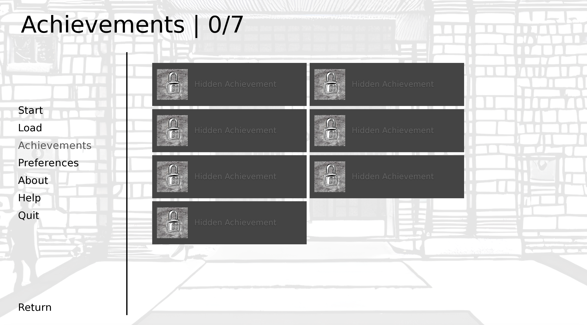

# Fail 101
 
 A visual novel written and developped by Johan Cuda using Ren'Py.

 This projet was developped during the course "Fiction Interactive" taught by Isaac Pante (SLI, Lettres, UNIL).

 ## Description

 This interactive fiction tries to recreate one of the main thing a student can experiment in their academic journey : failure.

 You are on your first day at university. Your only goal : fail in the most magical way. Be creative.

 

## How to play

 You can test the game on [itch.io](https://johancuda.itch.io/fail-101). You just have to download the file corresponding to your OS, extract it and then execute the game.

## Using the Ren'Py launcher

 If you want to check and modify the game files available in this repositery, you can download the [Ren'Py launcher](https://www.renpy.org/latest.html). You can then use it to launch the game and modify it (you can check the documentation [here](https://www.renpy.org/doc/html/)).

 ## Interface

 This game is using a classic Ren'Py interface. However, it features a few extra things:

 1. You'll find in the main menu an achievement system designed by `Angel Seraph` (see below in the `About Fail 101` section).

  

 2. You'll find in the `Preferences` menu a "Reset Persistent Data" button. This won't affect your achievements but will reset all the other variables (objects, decisions...).

 ## About Fail 101 

 The achievments system was designed by `Angel Seraph` and is available [here](https://glsuoa.itch.io/renpy-achievements).

 Every visual artwork displayed in the game was generated using Stable Diffusion 1.5 on [PlaygroundAI](https://playgroundai.com/).

 The soundtrack is available [here](https://pixabay.com/fr/music/jazz-traditionnel-cool-jazz-loops-2641/).

 Made using Ren'Py.
 

